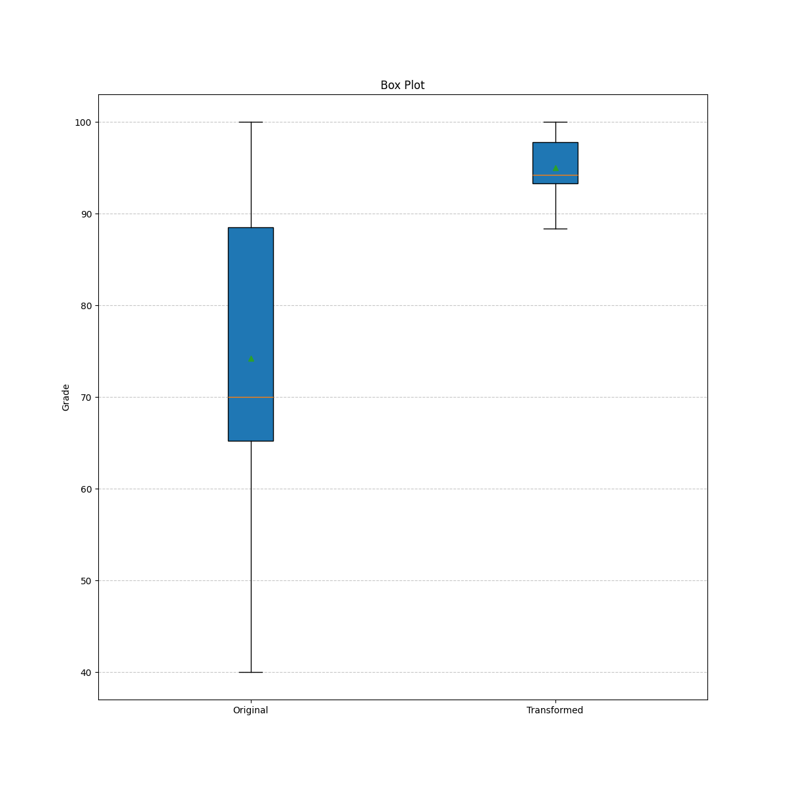

# Лабораторна робота 2

**Тема:** Лінійне перетворення та Графічне зображення даних

**Студент:** Прохода Семен ІП-з31

**Мета:** навчитись використовувати на практиці набуті знання про лінійні перетворення та графічне зображення даних.

## Завдання

1. Знайдіть $Q_1$ , $Q_3$ та $P_{90}$.
2. Знайти середнє значення та стандартне відхилення оцінок.
3. Змінити оцінки за формулою y = ax + b, де:

   - нове середнє = 95,
   - оцінка 100 залишається без змін.
   - Обчислити a та b.

4. Побудувати діаграму "стовбур–листя".
5. Побудувати коробкову діаграму.
6. Зробити короткий висновок за результатами обробки даних.

## Математична модель

**Квартилі:**

- $Q_1$: позиція $= (n+1) \times 0.25$
- $Q_3$: позиція $= (n+1) \times 0.75$
- $P_{90}$: позиція $= (n+1) \times 0.90$

**Описові статистики:**

- Середнє арифметичне: $\bar{x} = \frac{1}{n} \sum_{i=1}^{n} x_i$
- Стандартне відхилення: $\sigma = \sqrt{\frac{1}{n} \sum_{i=1}^{n} (x_i - \bar{x})^2}$

## Код

```python
import sys
import math
import matplotlib.pyplot as plt


def read_input_file(filename):
    with open(filename, "r") as file:
        lines = file.readlines()
        m = int(lines[0].strip())
        data = []
        for i in range(1, m + 1):
            data.append(int(lines[i].strip()))
        return data


def calculate_mean(data):
    return sum(data) / len(data)


def calculate_std_deviation(data):
    mean = calculate_mean(data)
    variance = sum((x - mean) ** 2 for x in data) / len(data)
    return math.sqrt(variance)


def percentile(data, percent):
    sorted_data = sorted(data)
    n = len(sorted_data)
    pos = (n + 1) * percent
    if pos == int(pos):
        return sorted_data[int(pos) - 1]
    lower = int(pos) - 1
    upper = min(lower + 1, n - 1)
    fraction = pos - int(pos)
    return sorted_data[lower] + fraction * (sorted_data[upper] - sorted_data[lower])


def find_quartiles(data):
    q1 = percentile(data, 0.25)
    q3 = percentile(data, 0.75)
    p90 = percentile(data, 0.90)
    return q1, q3, p90


def linear_transformation(data, target_mean, fixed_value):
    mean = calculate_mean(data)

    if mean == fixed_value:
        a = 1.0
        b = 0.0
    else:
        a = (target_mean - fixed_value) / (mean - fixed_value)
        b = fixed_value - a * fixed_value

    transformed_data = [a * x + b for x in data]
    return transformed_data, a, b


def create_stem_leaf_plot(data):
    sorted_data = sorted(data)
    stem_leaf = {}

    for value in sorted_data:
        stem = int(value) // 10
        leaf = int(value) % 10

        if stem not in stem_leaf:
            stem_leaf[stem] = []
        stem_leaf[stem].append(leaf)

    plot_lines = []
    plot_lines.append("Stem | Leaf")
    plot_lines.append("-----|-----")

    for stem in sorted(stem_leaf.keys()):
        leaves = sorted(stem_leaf[stem])
        leaves_str = " ".join(map(str, leaves))
        plot_lines.append(f"{stem:4d} | {leaves_str}")

    return "\n".join(plot_lines)


def create_box_plot_data(data):
    sorted_data = sorted(data)
    n = len(sorted_data)

    q1, q3, _ = find_quartiles(data)

    if n % 2 == 0:
        median = (sorted_data[n // 2 - 1] + sorted_data[n // 2]) / 2
    else:
        median = sorted_data[n // 2]

    iqr = q3 - q1
    lower_fence = q1 - 1.5 * iqr
    upper_fence = q3 + 1.5 * iqr

    whisker_low = min([x for x in sorted_data if x >= lower_fence])
    whisker_high = max([x for x in sorted_data if x <= upper_fence])

    outliers = [x for x in sorted_data if x < lower_fence or x > upper_fence]

    return {
        "min": whisker_low,
        "q1": q1,
        "median": median,
        "q3": q3,
        "max": whisker_high,
        "outliers": outliers,
    }


def create_box_plot(original_data, transformed_data, filename):
    plt.figure(figsize=(12, 12))
    plt.boxplot(
        [original_data, transformed_data],
        vert=True,
        patch_artist=True,
        showmeans=True,
        tick_labels=["Original", "Transformed"],
    )
    plt.title("Box Plot")
    plt.ylabel("Grade")
    plt.grid(axis="y", linestyle="--", alpha=0.7)
    plt.savefig(filename)
    plt.close()


def main():
    if len(sys.argv) != 2:
        print("Input file needed.")
        sys.exit(1)

    input_filename = sys.argv[1]
    output_filename = input_filename.replace(".txt", "_output.txt")

    grades = read_input_file(input_filename)

    q1, q3, p90 = find_quartiles(grades)

    mean = calculate_mean(grades)
    std_dev = calculate_std_deviation(grades)

    target_mean = 95
    fixed_grade = 100
    transformed_grades, a, b = linear_transformation(grades, target_mean, fixed_grade)

    transformed_mean = calculate_mean(transformed_grades)
    transformed_std = calculate_std_deviation(transformed_grades)

    stem_leaf_original = create_stem_leaf_plot(grades)
    stem_leaf_transformed = create_stem_leaf_plot(transformed_grades)

    create_box_plot(grades, transformed_grades, "boxplot.png")

    with open(output_filename, "w") as f:
        f.write("1.\n\n")
        f.write(f"Q1 : {q1:.2f}\n")
        f.write(f"Q3 : {q3:.2f}\n")
        f.write(f"P90 : {p90:.2f}\n\n")

        f.write("2.\n\n")
        f.write(f"Mean: {mean:.2f}\n")
        f.write(f"Standard Deviation: {std_dev:.2f}\n\n")

        f.write("3.\n\n")
        f.write(f"Transformation formula: y = {a:.3f}x + {b:.3f}\n")
        f.write(f"Original grades: {grades}\n")
        f.write(f"Transformed grades: {[round(x, 1) for x in transformed_grades]}\n")
        f.write(
            f"Original mean: {mean:.2f} -> Transformed mean: {transformed_mean:.2f}\n"
        )
        f.write(
            f"Original std dev: {std_dev:.2f} -> Transformed std dev: {transformed_std:.2f}\n\n"
        )

        f.write("4.\n\nStem-and-Leaf Plot (Original):\n")
        f.write(stem_leaf_original + "\n\n")

        f.write("Stem-and-Leaf Plot (Transformed):\n")
        f.write(stem_leaf_transformed + "\n\n")


if __name__ == "__main__":
    main()

```

## Тестування

### Вхідні дані:

```
10
40, 65, 62, 70, 100, 90, 66, 70, 95, 84
```

### Результати:

#### 1. Знайдіть $Q_1$ , $Q_3$ та $P_{90}$..

- Q1 : 64.25
- Q3 : 91.25
- P90 : 99.50

#### 2. Знайти середнє значення та стандартне відхилення оцінок.

- Mean: 74.20
- Standard Deviation: 17.17

#### 3. Змінити оцінки за формулою y = ax + b

- Transformation formula: y = 0.194x + 80.620
- Original grades: [40, 65, 62, 70, 100, 90, 66, 70, 95, 84]
- Transformed grades: [88.4, 93.2, 92.6, 94.2, 100.0, 98.1, 93.4, 94.2, 99.0, 96.9]
- Original mean: 74.20 -> Transformed mean: 95.00
- Original std dev: 17.17 -> Transformed std dev: 3.33

#### 4. Побудувати діаграму "стовбур–листя".

Stem-and-Leaf Plot (Original):

```
Stem | Leaf
-----|-----
   4 | 0
   6 | 2 5 6
   7 | 0 0
   8 | 4
   9 | 0 5
  10 | 0
```

Stem-and-Leaf Plot (Transformed):

```
Stem | Leaf
-----|-----
   8 | 8
   9 | 2 3 3 4 4 6 8 9
  10 | 0
```

#### 5. Побудувати коробкову діаграму.



## Висновки 

- Стандартне відхилення залишилось незмінним 
- Форма розподілу збереглась
- Всі оцінки покращились на 20.8 балів
