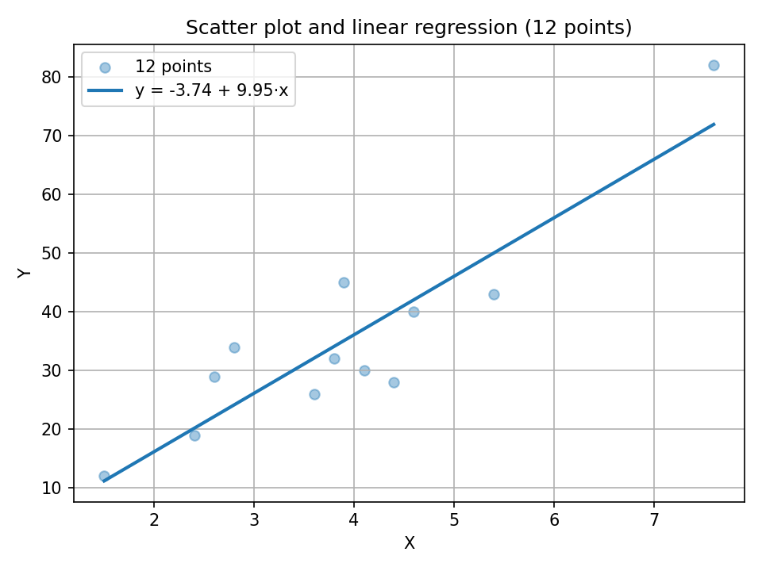

# Лабораторна робота 3

**Тема:** Двовимірна статистика

**Студент:** Прохода Семен ІП-з31

**Мета:** навчитись використовувати на практиці набуті знання про міри в двовимірній статистиці.

## Завдання

1. Намалюйте діаграму розсіювання для даних. Укажіть, чи існує тренд у даних.
2. Знайдіть центр ваги і коваріацію.
3. Знайти рівняння лінії регресії y від x.
4. Розрахуйте коефіцієнт кореляції між даними.
5. Зробити висновок про залежності.

## Математична модель

**Описові статистики:**

- Середнє арифметичне: $\bar{x} = \frac{1}{n} \sum_{i=1}^{n} x_i$, $\bar{y} = \frac{1}{n} \sum_{i=1}^{n} y_i$
- Коваріація: $\text{cov}(x,y) = \frac{1}{n} \sum_{i=1}^{n} (x_i - \bar{x})(y_i - \bar{y})$
- Дисперсія: $\text{var}(x) = \frac{1}{n} \sum_{i=1}^{n} (x_i - \bar{x})^2$

**Лінійна регресія:**

- Коефіцієнт нахилу: $b = \frac{\text{cov}(x,y)}{\text{var}(x)}$
- Вільний член: $a = \bar{y} - b\bar{x}$
- Рівняння регресії: $y = a + bx$

**Коефіцієнт кореляції:**

- $r = \frac{\text{cov}(x,y)}{\sqrt{\text{var}(x) \cdot \text{var}(y)}}$

## Код

```python
import sys
import re
import math
import matplotlib.pyplot as plt


def read_data(filename):
    x = []
    y = []
    with open(filename, "r", encoding="utf-8") as f:
        header = f.readline()
        nums = re.findall(r"\d+", header)
        M = int(nums[0])

        for line in f:
            if len(x) >= M:
                break
            s = line.strip()
            if not s:
                continue
            s = s.replace(",", ".")
            parts = s.split()
            if len(parts) < 2:
                continue
            try:
                xi = float(parts[0])
                yi = float(parts[1])
            except ValueError:
                continue
            x.append(xi)
            y.append(yi)

    if len(x) != M:
        raise ValueError(f"Expected {M} points, read {len(x)}")
    return M, x, y


def compute_statistics(M, x, y):
    mean_x = sum(x) / M
    mean_y = sum(y) / M

    cov = sum((xi - mean_x) * (yi - mean_y) for xi, yi in zip(x, y)) / M
    var_x = sum((xi - mean_x) ** 2 for xi in x) / M
    var_y = sum((yi - mean_y) ** 2 for yi in y) / M

    b = cov / var_x
    a = mean_y - b * mean_x
    r = cov / math.sqrt(var_x * var_y)

    trend = "positive" if b > 0 else "negative" if b < 0 else "absent"

    return {
        "M": M,
        "mean_x": mean_x,
        "mean_y": mean_y,
        "covariance": cov,
        "slope": b,
        "intercept": a,
        "r": r,
        "trend": trend,
    }


def plot_scatter(x, y, stats, out_img):
    plt.figure()
    plt.scatter(x, y, alpha=0.4, label=f"{stats['M']} points")
    x_min, x_max = min(x), max(x)
    xs = [x_min, x_max]
    ys = [stats["intercept"] + stats["slope"] * xi for xi in xs]
    plt.plot(
        xs,
        ys,
        linewidth=2,
        label=f"y = {stats['intercept']:.2f} + {stats['slope']:.2f}·x",
    )
    plt.title(f"Scatter plot and linear regression ({stats['M']} points)")
    plt.xlabel("X")
    plt.ylabel("Y")
    plt.legend()
    plt.grid(True)
    plt.tight_layout()
    plt.savefig(out_img, dpi=150)
    plt.close()


def write_output(stats, out_txt):
    with open(out_txt, "w", encoding="utf-8") as f:
        f.write(f"Number of points M = {stats['M']}\n")
        f.write(
            f"Center of gravity (mean_x, mean_y): "
            f"({stats['mean_x']:.6f}, {stats['mean_y']:.6f})\n"
        )
        f.write(f"Covariance: {stats['covariance']:.6f}\n")
        f.write(
            f"Regression equation: y = {stats['intercept']:.6f} "
            f"+ {stats['slope']:.6f}·x\n"
        )
        f.write(f"Correlation coefficient: {stats['r']:.6f}\n")
        f.write(f"Trend: {stats['trend']}\n")


def main():
    if len(sys.argv) != 2:
        print("Input file needed.")
        sys.exit(1)

    input_file = sys.argv[1]
    output_txt = "output.txt"
    output_img = "scatter.png"
    M, x, y = read_data(input_file)

    stats = compute_statistics(M, x, y)
    plot_scatter(x, y, stats, output_img)
    write_output(stats, output_txt)


if __name__ == "__main__":
    main()
```

## Тестування

### Вхідні дані:

```
12
2,4	19
1,5	12
7,6	82
3,8	32
2,8	34
4,6	40
4,1	30
5,4	43
3,9	45
2,6	29
4,4	28
3,6	26
```

### Результати:

#### 1. Діаграма розсіювання та визначення тренду



**Тренд:** позитивний (positive trend)

#### 2. Центр ваги та коваріація

- **Центр ваги (mean_x, mean_y):** (3.891667, 35.000000)
- **Коваріація:** 23.000000

#### 3. Рівняння лінії регресії y від x

**Рівняння регресії:** y = -3.735387 + 9.953418·x

- Коефіцієнт нахилу (b): 9.953418
- Вільний член (a): -3.735387

#### 4. Коефіцієнт кореляції

**Коефіцієнт кореляції:** r = 0.901001

#### 5. Параметри статистики

- **Кількість точок:** M = 12
- **Напрямок тренду:** позитивний
- **Сила зв'язку:** сильна (r ≈ 0.90)

## Висновки

1. **Існує сильний позитивний лінійний зв'язок** між сумою покупки та часом, проведеним у супермаркеті (r = 0.901).

2. **Коефіцієнт кореляції r = 0.901** свідчить про дуже сильну позитивну кореляцію між змінними.

3. **Рівняння регресії y = -3.74 + 9.95·x** показує, що при збільшенні суми покупки на 1 одиницю, час у супермаркеті збільшується в середньому на 9.95 одиниць.

4. **Позитивний тренд** підтверджує гіпотезу про те, що більші покупки потребують більше часу.

5. **Центр ваги** розташований у точці (3.89, 35.00), що відповідає середнім значенням обох змінних.

6. **Коваріація = 23.00** підтверджує позитивний характер зв'язку між змінними.
