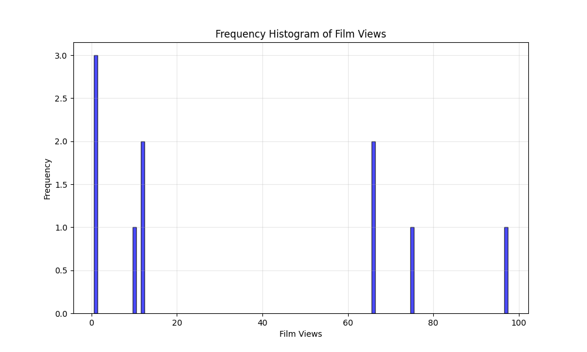

# Звіт з лабораторної роботи №1

**Тема:** Центральні тенденції та міра дисперсії

**Студент:** Прохода Семен ІП-з31

**Мета:** навчитись використовувати на практиці набуті знання про центральні тенденції та міри.

## Завдання

Створити програму для аналізу даних про перегляди фільмів:

1. Побудувати таблицю частот та сукупних частот для переглянутих фільмів. Визначити фільм, який був переглянутий частіше за інші.
2. Знайти Моду та Медіану заданої вибірки.
3. Порахувати Дисперсію та Середнє квадратичне відхилення розподілу.
4. Побудувати гістограму частот для даного розподілу.
5. Зробити висновок з вигляду гістограми, про закон розподілу.

## Математична модель

### Основні статистичні характеристики:

**1. Частота (Frequency)**

$$f(x_i) = \text{кількість появ значення } x_i \text{ у вибірці}$$

**2. Сукупна частота (Cumulative Frequency)**

$$F(x_i) = \sum_{x_j \leq x_i} f(x_j)$$

**3. Мода (Mode)**

$$Mo = x_i, \text{ де } f(x_i) = \max\{f(x_1), f(x_2), \ldots, f(x_n)\}$$

**4. Медіана (Median)**

$$
Me = \begin{cases}
x_{\left(\frac{n+1}{2}\right)}, & \text{якщо } n \text{ непарне} \\[0.5em]
\frac{x_{\left(\frac{n}{2}\right)} + x_{\left(\frac{n}{2}+1\right)}}{2}, & \text{якщо } n \text{ парне}
\end{cases}
$$

**5. Середнє арифметичне (Mean)**

$$\bar{x} = \frac{1}{n} \sum_{i=1}^{n} x_i$$

**6. Дисперсія (Variance)**

$$\sigma^2 = \frac{1}{n} \sum_{i=1}^{n} (x_i - \bar{x})^2$$

**7. Середнє квадратичне відхилення (Standard Deviation)**

$$\sigma = \sqrt{\sigma^2}$$

## Код

```python
import sys
import math
import matplotlib.pyplot as plt


def read_input_file(filename):
    with open(filename, "r") as file:
        lines = file.readlines()
        m = int(lines[0].strip())
        data = []
        for i in range(1, m + 1):
            data.append(int(lines[i].strip()))
        return data


def calculate_frequency_table(data):
    freq_dict = {}
    for value in data:
        if value in freq_dict:
            freq_dict[value] += 1
        else:
            freq_dict[value] = 1

    sorted_values = []
    for value in freq_dict:
        sorted_values.append(value)

    sorted_values.sort()

    freq_table = []
    cumulative_freq = 0

    for value in sorted_values:
        frequency = freq_dict[value]
        cumulative_freq += frequency
        freq_table.append((value, frequency, cumulative_freq))

    return freq_table


def find_most_frequent(freq_table):
    max_freq = 0
    most_frequent_film = 0

    for value, frequency, _ in freq_table:
        if frequency > max_freq:
            max_freq = frequency
            most_frequent_film = value

    return most_frequent_film, max_freq


def calculate_mode(freq_table):
    max_frequency = 0
    modes = []

    for value, frequency, _ in freq_table:
        if frequency > max_frequency:
            max_frequency = frequency

    for value, frequency, _ in freq_table:
        if frequency == max_frequency:
            modes.append(value)

    return modes


def calculate_median(data):
    sorted_data = data[:]
    sorted_data.sort()
    n = len(sorted_data)

    if n % 2 == 0:
        median = (sorted_data[n // 2 - 1] + sorted_data[n // 2]) / 2.0
    else:
        median = sorted_data[n // 2]

    return median


def calculate_mean(data):
    total = 0
    for value in data:
        total += value
    return total / len(data)


def calculate_variance_and_std(data):
    mean = calculate_mean(data)

    sum_squared_diff = 0
    for value in data:
        diff = value - mean
        sum_squared_diff += diff * diff

    variance = sum_squared_diff / len(data)

    std_dev = math.sqrt(variance)

    return variance, std_dev


def create_histogram(data, output_filename):
    freq_dict = {}
    for value in data:
        if value in freq_dict:
            freq_dict[value] += 1
        else:
            freq_dict[value] = 1

    items = sorted(freq_dict.items())
    values = [item[0] for item in items]
    frequencies = [item[1] for item in items]

    plt.figure(figsize=(10, 6))
    plt.bar(values, frequencies, alpha=0.7, color="blue", edgecolor="black")
    plt.xlabel("Film Views")
    plt.ylabel("Frequency")
    plt.title("Frequency Histogram of Film Views")
    plt.grid(True, alpha=0.3)

    histogram_filename = output_filename.replace(".txt", "_histogram.png")
    plt.savefig(histogram_filename)
    plt.close()

    return histogram_filename


def write_output(filename, freq_table, most_frequent, modes, median, variance, std_dev):
    with open(filename, "w") as file:
        file.write("1. \n\n")
        file.write(f"| {'Value':<8} | {'Frequency':<12} | {'Cumulative':<12} |\n")
        file.write(f"|{'-' * 10}|{'-' * 14}|{'-' * 14}|\n")

        for value, freq, cum_freq in freq_table:
            file.write(f"| {value:<8} | {freq:<12} | {cum_freq:<12} |\n")

        file.write(
            f"\nMost frequently viewed film: {most_frequent[0]} (viewed {most_frequent[1]} times)\n\n"
        )

        file.write("2.\n\n")
        if len(modes) == 1:
            file.write(f"Mode: {modes[0]}\n")
        else:
            file.write(f"Modes: {', '.join(map(str, modes))}\n")
        file.write(f"Median: {median}\n\n")

        file.write("3.\n\n")
        file.write(f"Variance: {variance:.6f}\n")
        file.write(f"Standard Deviation: {std_dev:.6f}\n\n")


def main():
    if len(sys.argv) != 2:
        print("Input file needed.")
        sys.exit(1)

    input_filename = sys.argv[1]
    output_filename = input_filename.replace(".txt", "_output.txt")

    data = read_input_file(input_filename)

    freq_table = calculate_frequency_table(data)
    most_frequent = find_most_frequent(freq_table)
    modes = calculate_mode(freq_table)
    median = calculate_median(data)
    variance, std_dev = calculate_variance_and_std(data)
    create_histogram(data, output_filename)

    write_output(
        output_filename,
        freq_table,
        most_frequent,
        modes,
        median,
        variance,
        std_dev
    )

if __name__ == "__main__":
    main()

```

## Тестування

**Вхідні дані:**

```
10
1, 66, 75, 1, 1, 12, 10, 97, 12, 66
```

**Результати:**

| Значення | Частота | Сукупна частота |
| -------- | ------- | --------------- |
| 1        | 3       | 3               |
| 10       | 1       | 4               |
| 12       | 2       | 6               |
| 66       | 2       | 8               |
| 75       | 1       | 9               |
| 97       | 1       | 10              |

- **Найпопулярніший фільм:** 1 (3 перегляди)
- **Мода:** 1
- **Медіана:** 12.0
- **Дисперсія:** 1250.89
- **Стандартне відхилення:** 35.37
- **Гістограма:**



## Висновки

1. Дані мають асиметричний розподіл
2. Висока варіабельність даних (σ = 35.37)
3. Більшість фільмів мають низьку популярність
